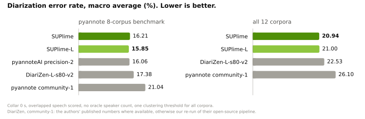

<p align="center"></p>

# SUPlime speaker diarization

*SUP as in "what's up": who is speaking, and when.*

Speaker diarization by research team at [Re:WayAI](https://rewayai.ai), packaged for
[pyannote.audio](https://github.com/pyannote/pyannote-audio) 4.x.

* **Segmentation**: WavLM-Base+ (learned 12-layer mixture) → 4-layer Conformer →
  powerset classifier (4 speakers / 10 s window, up to 2 simultaneous). 114 M params.
* **Embedding**: WeSpeaker SimAM-ResNet34 with attentive statistics pooling
  (`voxblink2_samresnet34_ft`, 25 M params, 256-dim).
* **Clustering**: agglomerative (centroid linkage), overlap excluded from embeddings.

Model weights and the full model card live on the Hugging Face Hub:
**https://huggingface.co/rewayai/suplime**. The weights are CC BY-NC 4.0
(non-commercial) because part of the training data is licensed for research use
only, which rules out commercial use of models derived from it. This package is
the code those checkpoints point at; without it pyannote.audio cannot
instantiate them.

## Install

```bash
pip install suplime            # pulls pyannote.audio>=4.0.7,<5
```

## Use

```python
import torch
from pyannote.audio import Pipeline

pipeline = Pipeline.from_pretrained("rewayai/suplime").to(torch.device("cuda"))
output = pipeline("meeting.wav")
for turn, _, speaker in output.speaker_diarization.itertracks(yield_label=True):
    print(f"{turn.start:.2f} {turn.end:.2f} {speaker}")
```

No Hugging Face token is needed: the repository is not gated.

The same system without `config.yaml`:

```python
from suplime import SuplimeDiarization
pipeline = SuplimeDiarization()                       # defaults = rewayai/suplime
pipeline.instantiate(pipeline.default_parameters())   # threshold 0.72, min_cluster_size 12
```

Individual models load through the usual API:

```python
from pyannote.audio import Model
seg = Model.from_pretrained("rewayai/suplime", subfolder="segmentation")
emb = Model.from_pretrained("rewayai/suplime", subfolder="embedding")
```

Set `SUPLIME_FP16=0` to run the WavLM backbone in fp32 (default: fp16 autocast
on CUDA during inference — the published numbers were produced this way).

## Results

<picture>
  <source media="(prefers-color-scheme: dark)" srcset="assets/results_dark.svg">
  
</picture>

DER (%) with collar 0 s and overlapped speech scored, no oracle speaker count, **one threshold (0.72) for all corpora**. DiariZen-L-s80-v2 and the
`community-1` / `precision-2` columns are the numbers their authors publish
([DiariZen](https://github.com/BUT-FIT/DiariZen),
[pyannote](https://huggingface.co/pyannote/speaker-diarization-community-1)).
† not published by that system's authors: we ran their open-source pipeline
unchanged (default parameters) on the same files with the same scoring. For
NOTSOFAR-1 the DiariZen authors report 16.7 on a different session split.

| Corpus (test unless noted) | **SUPlime** | DiariZen-L-s80-v2 | pyannoteAI precision-2 | pyannote community-1 |
|---|--:|--:|--:|--:|
| AISHELL-4 | 11.55 | **10.1** | 11.4 | 11.7 |
| AliMeeting (far, ch1) | 14.45 | **10.8** | 15.2 | 20.3 |
| AMI (IHM, Mix-Headset) | **12.59** | 25.69 † | 12.9 | 17.0 |
| AMI (SDM) | 15.14 | **13.9** | 15.6 | 19.9 |
| AVA-AVD | 38.09 | 42.62 † | **37.1** | 44.6 |
| MSDWild (few.val) | 17.81 | **15.8** | 17.3 | 22.8 |
| RAMC | 10.86 | 11.0 | **10.5** | 20.8 |
| VoxConverse (v0.3) | 9.21 | 9.1 | **8.5** | 11.2 |
| **macro average (8)** | **16.21** | 17.38 | 16.06 | 21.04 |
| NOTSOFAR-1 (80-session split) | 20.04 | **18.86 †** | — | 27.67 † |
| ICSI | **22.97** | 26.54 † | — | 30.84 † |
| CHiME-6 | **48.11** | 48.39 † | — | 51.98 † |
| DiPCo | **30.44** | 37.56 † | — | 34.38 † |
| **macro average (12)** | **20.94** | 22.53 | — | 26.10 |

On the 12-corpus set SUPlime is ahead of DiariZen-L-s80-v2 (a WavLM-Large system
with roughly 3× the segmentation compute) on 6 of 12 corpora and by 1.6 DER
absolute on the macro average, with the largest margins on close-talk AMI and on
the CHiME-6 / DiPCo dinner-party recordings. On pyannote's 8-corpus benchmark it
is on par with pyannoteAI's commercial `precision-2`. Per-corpus hypothesis
RTTMs are published with the model, see the model card for threshold behaviour
and known limitations.

## Training

The full recipe is in [`training/README.md`](training/README.md): the training
splits of the 11 public corpora, the augmentation data, and
one command that reproduces the published checkpoint on stock pyannote.audio:

```bash
pip install "suplime[train]"
suplime-train --out runs/suplime --database training/database.yml --aug-root aug_data
suplime-soup runs/suplime/checkpoints -k 5 -o suplime_avg5.ckpt
```

About 48 GPU-hours on one 32 GB card; interrupted runs resume from `last.ckpt`
with the same command.

## Development

```bash
pip install -e ".[test]"
pytest                          # checkpoint tests skip unless hf/ holds the converted weights
python tools/convert_checkpoints.py --segmentation <ckpt> --embedding <ckpt> --out hf
python tools/upload_hf.py --repo rewayai/suplime
```

## License

Code: MIT (`src/suplime/models/samresnet.py`: Apache-2.0, ported from
[WeSpeaker](https://github.com/wenet-e2e/wespeaker)). Model weights: CC BY-NC 4.0.
Non-commercial because several training corpora (RAMC, MSDWild, AVA-AVD) are
licensed for research use only and others (AISHELL-4, AliMeeting) are share-alike;
the most restrictive terms apply to the derived model. Details in the model card. Built on pyannote.audio (MIT), WavLM (MIT) and WeSpeaker (Apache-2.0).

## Diarization is not enough?

SUPlime tells you *who* spoke and *when*. If you also want to know *what* they said,
and *who they actually are*, that is our day job: [Re:WayAI](https://rewayai.ai) is
the speech API that knows who's talking.

- Transcription in 25 European languages (40 for real-time streaming), with
  overlap-robust diarization from the same team that built SUPlime
- Voice enrollment: speakers get their real names, not `SPEAKER_03`
- Real-time streaming over WebSocket, transcript Q&A, one-click DOCX / PDF exports
- On-premise deployment, audio deleted right after processing, ISO 27001

Pay-as-you-go, 50 free hours to start, no subscription. The lime approves.
