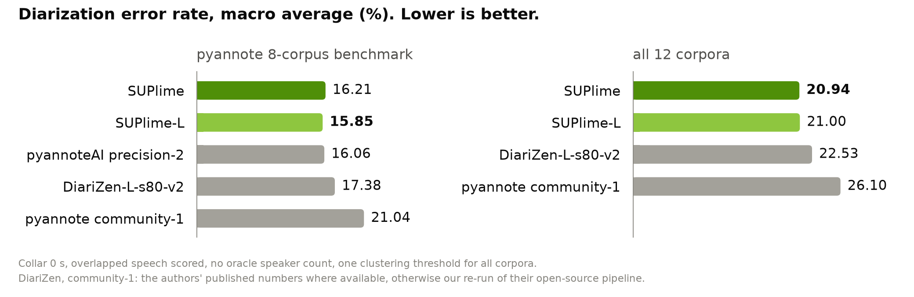

<p align="center"></p>

# SUPlime-L — speaker diarization (WavLM-Large)

*SUP as in "what's up": who is speaking, and when.*

Open-weights speaker diarization by [Re:WayAI](https://rewayai.ai), packaged for
[pyannote.audio](https://github.com/pyannote/pyannote-audio) 4.x. One 16 kHz mono
recording in, who-spoke-when out; no speaker count needed.

This is the **WavLM-Large** variant of [SUPlime](https://huggingface.co/rewayai/suplime):
same recipe, same embedding, same clustering, a 315 M-parameter backbone instead of 94 M.
It is the better model on pyannote's 8-corpus benchmark — **15.85 macro DER, ahead of
pyannoteAI's commercial `precision-2` (16.06)** — and the base model is better across all
12 corpora. Pick by domain, not by size; see [Which variant](#which-variant).

**Weights are released under CC BY-NC 4.0 (non-commercial)** because part of the
training data is licensed for research use only, which rules out commercial use of
models derived from it — see [LICENSE](LICENSE) and the rationale below.

## Quick start

```bash
pip install suplime      # installs pyannote.audio>=4.0.7 and the model code
```

```python
import torch
from pyannote.audio import Pipeline

pipeline = Pipeline.from_pretrained("rewayai/suplime-large").to(torch.device("cuda"))
output = pipeline("meeting.wav")
for turn, _, speaker in output.speaker_diarization.itertracks(yield_label=True):
    print(f"{turn.start:.2f} {turn.end:.2f} {speaker}")
```

No Hugging Face token or gated access is required. The `suplime` package is
needed because the checkpoints reference model classes that do not exist in
pyannote.audio itself; without it pyannote raises `MissingDependency`.

Optional knobs:

```python
pipeline("meeting.wav", num_speakers=3)          # or min_speakers= / max_speakers=
pipeline.instantiate({"clustering": {"threshold": 0.68, "min_cluster_size": 12, "method": "centroid"},
                      "segmentation": {"min_duration_off": 0.0}})   # lower threshold = more speakers
```

`SUPLIME_FP16=0` runs the WavLM backbone in fp32 (default: fp16 autocast on CUDA
during inference — all numbers below were produced with the default).

## Architecture

| Stage | Model | Details |
|---|---|---|
| Segmentation | WavLM-Large → Conformer → powerset | 24 WavLM layers mixed with learned softmax weights; 4 Conformer layers (4 heads, FFN 256, depthwise kernel 31, dropout 0.1); 2 linear layers (128); powerset output over 4 speakers with ≤ 2 simultaneous (11 classes); 10 s windows, 20 ms frames, window step 1 s. 349 M parameters. |
| Embedding | WeSpeaker SimAM-ResNet34 + attentive statistics pooling | `voxblink2_samresnet34_ft` (VoxBlink2 pre-training, VoxCeleb2 fine-tuning), converted to a pyannote model; 256-dim, cosine metric; overlapping speech excluded from pooling. 25 M parameters. |
| Clustering | Agglomerative, centroid linkage | threshold 0.72, `min_cluster_size` 12 (pyannote's standard AHC). |

The segmentation model was fine-tuned end to end (WavLM unfrozen) on the training
splits of 11 public corpora — AMI (IHM and SDM), ICSI, VoxConverse, CHiME-6, DiPCo,
NOTSOFAR-1, AISHELL-4, AliMeeting, MSDWild, RAMC and AVA-AVD (4,187 files) — with
in-batch speaker mixing, simulated-RIR reverberation and MUSAN noise; AdamW, lr 5e-5,
weight decay 0.01, OneCycle schedule, gradient clipping 0.5, bf16 mixed precision,
10 s chunks. Training ran in two stages: 15 epochs at effective batch 32 on one GPU,
then 20 epochs at effective batch 192 across 8 GPUs under a fresh OneCycle (same peak
lr), with early stopping (patience 10). The released weights are the average of the
5 best validation checkpoints. The recipe — training splits, augmentation data, one
`suplime-train` command on stock pyannote.audio — is published in
[`training/`](https://github.com/rewayai/suplime/tree/main/training) of the GitHub
repository; pass `--wavlm WAVLM_LARGE` for this variant. Repository layout follows pyannote's conventions:
`config.yaml` (pipeline), `segmentation/pytorch_model.bin`, `embedding/pytorch_model.bin`.

## Results



Diarization error rate (%, lower is better) under pyannote's benchmark conditions:
**collar 0 s, overlapped speech scored, fully automatic** (no oracle speaker count),
reference cropped to each corpus' UEM, and **a single threshold (0.72) for every corpus**.
DiariZen-L-s80-v2 and the `community-1` / `precision-2` columns are the numbers
their authors publish ([DiariZen](https://github.com/BUT-FIT/DiariZen),
[pyannote](https://huggingface.co/pyannote/speaker-diarization-community-1)).
† not published by that system's authors: we ran their open-source pipeline
unchanged (default parameters) on the same files with the same scoring. For
NOTSOFAR-1 the DiariZen authors report 16.7 on a different session split.

| Corpus (test unless noted) | **SUPlime-L** | SUPlime | DiariZen-L-s80-v2 | pyannoteAI precision-2 | pyannote community-1 |
|---|--:|--:|--:|--:|--:|
| AISHELL-4 | 11.21 | 11.55 | **10.1** | 11.4 | 11.7 |
| AliMeeting (far, ch1) | 14.55 | 14.45 | **10.8** | 15.2 | 20.3 |
| AMI (IHM, Mix-Headset) | 11.91 | **12.59** | 25.69 † | 12.9 | 17.0 |
| AMI (SDM) | 14.84 | 15.14 | **13.9** | 15.6 | 19.9 |
| AVA-AVD | 36.78 | 38.09 | 42.62 † | **37.1** | 44.6 |
| MSDWild (few.val) | 17.48 | 17.81 | **15.8** | 17.3 | 22.8 |
| RAMC | 11.10 | 10.86 | 11.0 | **10.5** | 20.8 |
| VoxConverse (v0.3) | 8.93 | 9.21 | 9.1 | **8.5** | 11.2 |
| **macro average (8)** | **15.85** | 16.21 | 17.38 | 16.06 | 21.04 |
| NOTSOFAR-1 (80-session split) | 22.68 | 20.04 | **18.86 †** | — | 27.67 † |
| ICSI | 22.77 | **22.97** | 26.54 † | — | 30.84 † |
| CHiME-6 | 48.88 | **48.11** | 48.39 † | — | 51.98 † |
| DiPCo | 30.92 | **30.44** | 37.56 † | — | 34.38 † |
| **macro average (12)** | **21.00** | **20.94** | 22.53 | — | 26.10 |

Reading the table: on pyannote's 8-corpus benchmark SUPlime-L is the strongest system
here — 15.85 macro DER, ahead of pyannoteAI's commercial `precision-2` (16.06), the base
SUPlime (16.21) and DiariZen-L-s80-v2 (17.38) — winning 5 of the 8 rows. Across all 12
corpora the ranking flips: 21.00 against 20.94 for the base model, because the four extra
sets are far-field and dinner-party recordings where the larger backbone does not help and
NOTSOFAR-1 costs it 2.6 DER. DiariZen is still clearly better on the Mandarin meeting
corpora (AISHELL-4, AliMeeting) and MSDWild.
The per-corpus hypothesis RTTMs are in [`reproducible_research/`](reproducible_research/).

## Which variant

| | [SUPlime](https://huggingface.co/rewayai/suplime) | **SUPlime-L** (this model) |
|---|--:|--:|
| Backbone | WavLM-Base+ | WavLM-Large |
| Parameters (segmentation) | 114 M | 349 M |
| macro DER, 8-corpus benchmark | 16.21 | **15.85** |
| macro DER, all 12 corpora | **20.94** | 21.00 |
| Relative inference cost | 1× | ≈ 3× |

Take SUPlime-L for meeting and conversational audio of the kind the benchmark covers, and
when accuracy matters more than throughput. Take the base model for far-field and
dinner-party audio (CHiME-6, DiPCo, NOTSOFAR-1), for CPU or edge deployment, or when you
want the cheaper model that is within 0.4 DER of it almost everywhere. Both share the
embedding, the clustering and the operating threshold, so switching is a one-line change.

## Limitations

- **Threshold.** 0.72 is a DER-optimal compromise across corpora. AISHELL-4 and
  AliMeeting prefer ≈ 0.68 and degrade sharply above 0.74 (AISHELL-4: 19.1 at 0.80);
  AMI-IHM and VoxConverse prefer 0.78–0.84. Tune on your own data. A DER-optimal
  threshold tends to over-merge speakers; if your downstream metric is
  speaker-attributed WER, a slightly higher threshold is usually better.
- Roughly 3× the segmentation compute and memory of the base model for 0.36 DER on the
  8-corpus benchmark, and it is *behind* the base model on the 12-corpus macro average.
- The powerset head models at most 2 simultaneous speakers per frame and 4 speakers
  per 10 s window; recordings with heavy 3-way overlap are under-served.
- Trained on 16 kHz meeting / conversational / broadcast / movie audio; telephone
  (8 kHz) speech is out of domain and is resampled, not modelled.
- The embedding model is trained on VoxBlink2 / VoxCeleb2 (largely English YouTube
  speech); no fairness evaluation across languages or demographics has been done.
- English and Mandarin dominate the training data.

## License and attribution

**Model weights** (`segmentation/`, `embedding/`): [CC BY-NC 4.0](LICENSE).
The segmentation model was trained on corpora with mixed terms: several are
licensed for research / non-commercial use only (RAMC, MSDWild, AVA-AVD) and
others are share-alike (AISHELL-4, AliMeeting, CC BY-SA 4.0). A model derived
from that data is bound by the most restrictive of those terms, so the weights
cannot be offered for commercial use and are released under CC BY-NC 4.0. The embedding weights are a conversion of WeSpeaker's
`voxblink2_samresnet34_ft` and remain subject to WeSpeaker's and the VoxBlink2 /
VoxCeleb2 data terms.

**Code** (`suplime` package): MIT; the SimAM-ResNet backbone is Apache-2.0,
ported from [WeSpeaker](https://github.com/wenet-e2e/wespeaker).

Built on [pyannote.audio](https://github.com/pyannote/pyannote-audio) (Bredin et al.),
[WavLM](https://arxiv.org/abs/2110.13900) (Chen et al., Microsoft, MIT) and
[WeSpeaker](https://arxiv.org/abs/2210.17016) (Wang et al.). The powerset
segmentation formulation follows Plaquet & Bredin, *Powerset multi-class cross
entropy loss for neural speaker diarization* (Interspeech 2023); the WavLM +
Conformer segmentation design is in the spirit of
[DiariZen](https://github.com/BUT-FIT/DiariZen) (Han et al., BUT).

## Citation

```bibtex
@misc{suplimel2026,
  title  = {SUPlime-L: open-weights speaker diarization for pyannote.audio},
  author = {Re:WayAI},
  year   = {2026},
  url    = {https://huggingface.co/rewayai/suplime-large}
}
```

## Diarization is not enough?

SUPlime tells you *who* spoke and *when*. If you also want to know *what* they said,
and *who they actually are*, that is our day job: [Re:WayAI](https://rewayai.ai) is
the speech API that knows who's talking.

- Transcription in 25 European languages (40 for real-time streaming), with
  overlap-robust diarization from the same team that built SUPlime
- Voice enrollment: speakers get their real names, not `SPEAKER_03`
- Real-time streaming over WebSocket, transcript Q&A, one-click DOCX / PDF exports
- On-premise deployment, audio deleted right after processing, ISO 27001

Pay-as-you-go, 50 free hours to start, no subscription. The lime approves.
